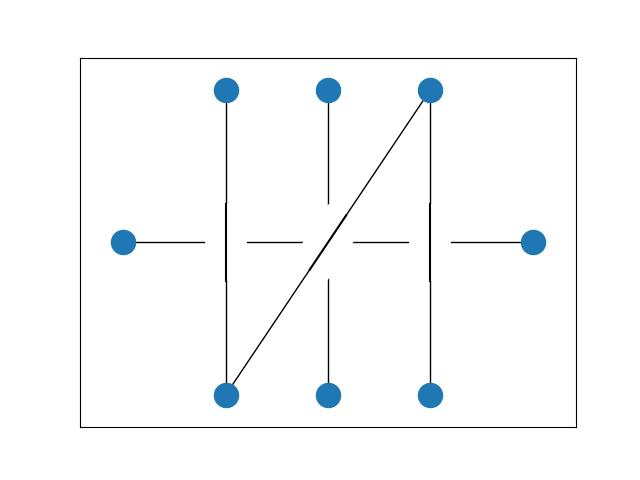

# Cased-Drawings

In a cased drawing of a graph, one edge is drawn above all other edges at each crossing. Cased drawings where first
introduced by Eppstein, van Kreveld, Mumford and Speckmann in 2009. See [1] for details. 

This project formulates a mixed integer linear program for different optimization goals related to switches as well
as different models defined by the original authors. The commercial MILP solver Gurobi is used to solve the program.
A valid license for Gurobi is needed, free academic licenses are available.

[1] David Eppstein, Marc van Kreveld, Elena Mumford, and Bettina Speckmann.
Edges and switches, tunnels and bridges. Computational Geometry, 42(8):790–
802, 2009

## Usage

The script can both be used via a command line interface as well as directly in Python. The CLI accepts the following
parameters:

    cased_drawings.py -- file graph.json --model 1 --goal 1 --output drawing.jpg

The 'model' argument accepts the following options:

- 1 - Weaving model: At each crossing, the top edge is chosen independently.
- 2 - Stacking model: An underlying total edge order determines which edge is the top edge at each crossing.
- 3 - Realizable model: A cased drawing is realizbel if an equivalent plane projection of line segments in 3D exists.

The 'goal' argument accepts the following options:

- 1 - Minimize the total number of switches
- 2 - Maximize the total number of switches
- 3 - Minimize the maximum number of switches per edge
- 4 - Minimize the number of edges with at least one switch
